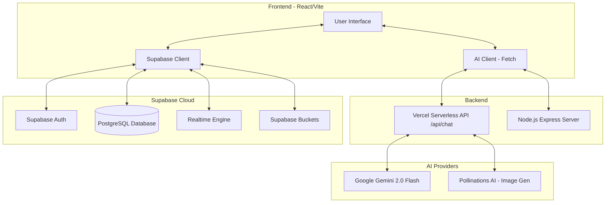
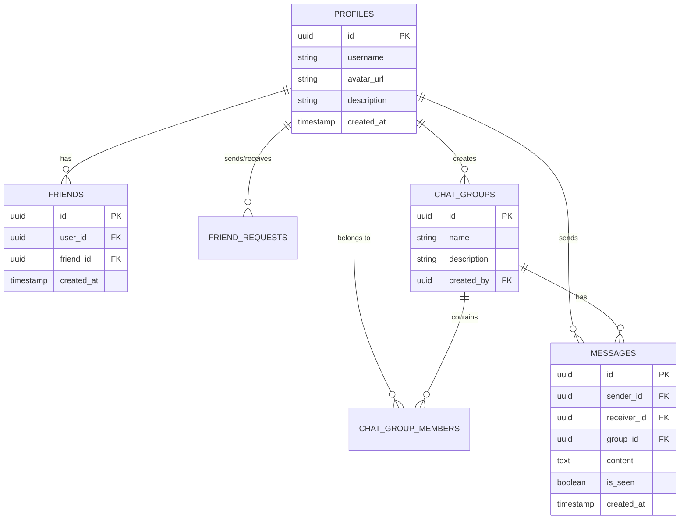
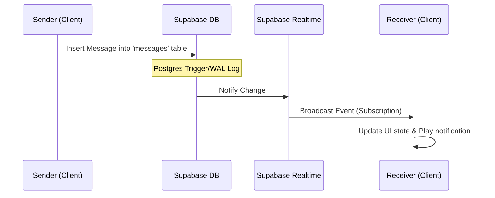
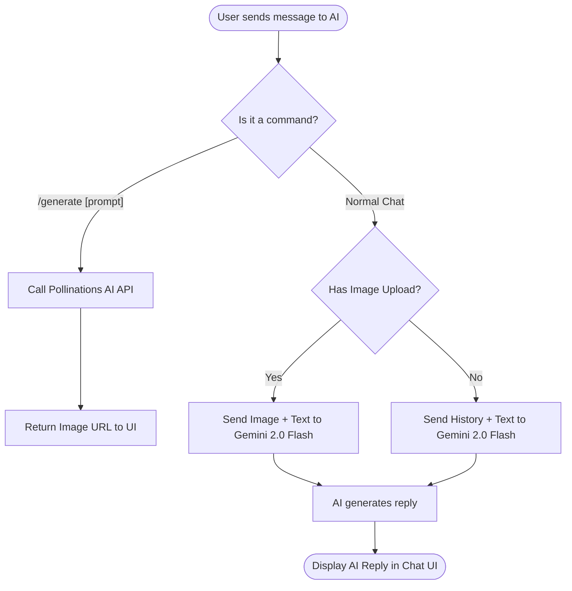
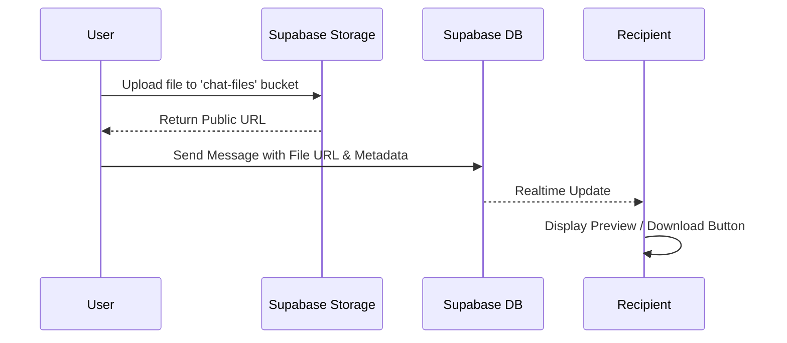
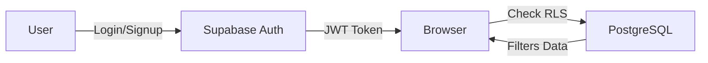

# UniqueChat Architectural Diagrams & Process Flows

This document provides a visual representation of how **UniqueChat** works, including its system architecture, database structure, and key process flows using Mermaid diagrams.

---

## 1. High-Level System Architecture

This diagram shows the interaction between the frontend, the backend services, and external APIs.

---

## 2. Database Schema (ER Diagram)

Representing the relationships between users, messages, friends, and groups.

---

## 3. Real-time Messaging Flow

How messages are delivered instantly without page refreshes.

---

## 4. AI Best Friend Interaction Flow

Processing chat messages, image analysis, and image generation.

---

## 5. File Sharing Process

Handling uploads and sharing documents/images in chat.

---

## 6. Authentication & Authorization

---

Documentation prepared by **Antigravity AI**.
*Architecture & Process Diagrams for UniqueChat*
